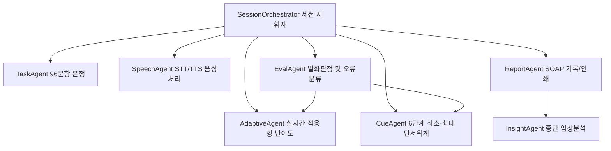

# 🏥 유니원 리햅 (UniRehab Pro v2.0)
> **Agentic AI 성인 후천성 언어재활 솔루션 (Adult Speech-Language Rehabilitation Web App)**

[](https://github.com/doyoon5575/unirehab-speech)
[](LICENSE)
[]()

유니원 리햅(UniRehab Pro)은 뇌졸중(뇌경색·뇌출혈), 외상성 뇌손상(TBI), 신경퇴행성 질환 등으로 인한 성인 실어증(Aphasia) 및 인지-의사소통 장애 대상자의 자율적 언어 회복과 언어재활사의 정밀한 임상 치료 관리를 지원하는 **7대 에이전틱(Agentic AI) 웹 애플리케이션**입니다.

---

## ✨ 핵심 기능 및 7대 에이전틱 아키텍처



1. **SessionOrchestrator**: 상태머신(State Machine) 기반으로 문항 제시 → 발화 인식 → 다차원 판정 → 단서 위계 승격 → 난이도 적응 → 피드백 루프를 끊김 없이 지휘
2. **TaskAgent & 자체 문항 은행(96문항)**:
   - 4개 핵심 영역: 어휘 인출(이름대기), 문장 완성(구문 산출), 청각적 이해(식별), 일상 대화(화용)
   - 3단계 난이도 위계 (기초 · 중급 · 심화)
3. **CueAgent (단서 위계 체계)**:
   - 임상 표준 Least-to-Most 6단계 단서 체계: `자발(100점) → 의미(85점) → 문맥(75점) → 초성(65점) → 첫음절(55점) → 보기선택(40점) → 따라말하기(25점)`
4. **EvalAgent (다차원 발화 판정 & 오류 분류)**:
   - STT 대체후보 5개 전수 분석 + 한글 자모 단위 음운 유사도
   - 7종 임상 오류 자동 분류 (음소 착어, 의미 착어, 우회 표현, 무반응 등)
5. **AdaptiveAgent (실시간 적응형 난이도)**:
   - 수행 연속 성공(3회 자발 정답) 시 실시간 난이도 상향, 오답 지속(2회) 시 자동 하향하여 대상자 좌절 방지
6. **InsightAgent (종단 임상 인사이트)**:
   - 회기 간 추세 분석, 단기치료목표(STG 80%) 3회 연속 달성 여부 판정, 수행 정체 및 훈련 공백 경고
7. **ReportAgent (임상 SOAP 노트)**:
   - 정량 지표 기반 SOAP 자동 초안 생성 및 실시간 치료사 수정 기능
   - Excel 호환 UTF-8 BOM CSV 내보내기 및 A4 표준 기록지 인쇄

---

## 🎨 디자인 시스템: Clinical Light
- 신뢰감 있는 오프화이트(`#F8FAFC`) 배경과 딥 틸블루(`#0B6E99`), 세이지 민트 헬스케어 팔레트 적용
- 시인성 보장을 위한 **3단계 글자 크기(text-md, text-lg, text-xl)** 및 **고대비 모드(High Contrast)** 지원
- 외부 CDN 연결 없이 오프라인에서도 작동하는 독립 인라인 SVG 아이콘 시스템

---

## 🔒 개인정보 및 임상 데이터 보안
- 본 프로그램은 **100% 클라이언트 로컬 스토리지(LocalStorage)** 기반으로 작동합니다.
- 환자 인적 사항, 진단명, 발화 녹음 및 훈련 기록이 외부 상용 서버 DB로 전송되지 않아 의료·연구 윤리 가이드라인을 철저히 준수합니다.

---

## 🚀 빠른 시작 (Local Run)

```bash
# 레포지토리 클론
git clone https://github.com/doyoon5575/unirehab-speech.git
cd unirehab-speech

# 로컬 개발 서버 실행
npm start
# 브라우저에서 http://localhost:3000 접속
```

---

## 📱 PWA & 태블릿 설치
태블릿(iPad Safari, Android Chrome) 브라우저에서 접속 후 **[홈 화면에 추가]**를 누르면 상단 주소창이 없는 독립형 전체화면 재활 전용 앱으로 구동됩니다.
